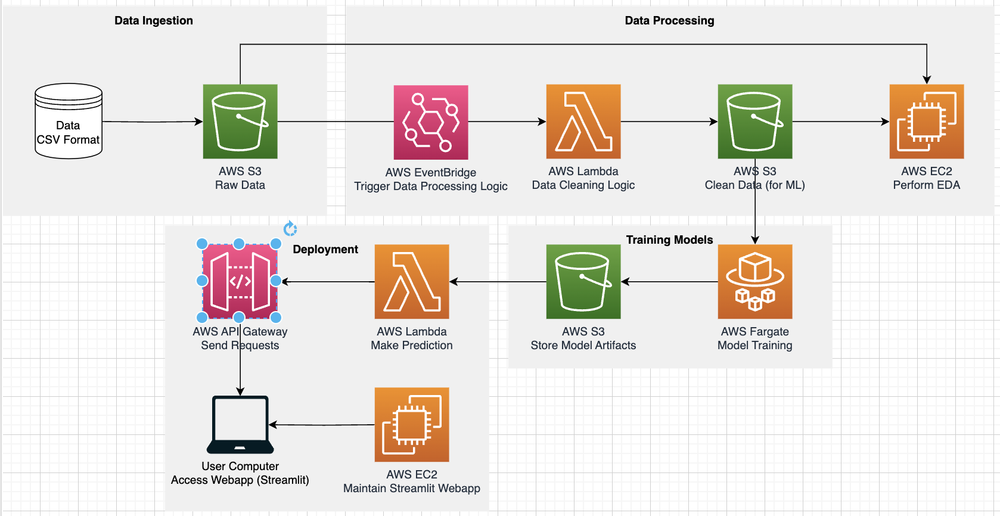

# Cloud_Engineering Final Project
## Predicting Airline Prices 
## Developed by: 
- Alejandra Lelo de Larrea Ibarra ali8110
- Bannasorn Paspanthong
- Ruben Nakano
- Samuel Swain

This project develops a model to classify clouds into one of two types based on features generated from cloud images.

<br/>

## Table of Contents 
- [Buisness Problem](#id-BusinessProblem)
- [Data Description](#id-DataDesc)
- [Data Science Project](#id-DSProject)
- [Pipeline](#id-Pipeline)
- [Web Application](#id-WebApp)
- [Project Structure](#id-Structure)

<br/><div id='id-BuisnessProblem'/>

## Business Problem

Airline ticket prices are subject to constant fluctuations due to various factors such as demand, availability, competition, seasonal trends, and economic conditions. 

For airlines, having a reliable prediction system can greatly assist in:
- Make informed decisions regarding pricing strategies, revenue management, and resource allocation based on the forecasts.
- Revenue Optimization: airlines can leverage price predictions to optimize their resource allocation and revenue management strategies. 
- Customer retention: satisfied customers are more likely to choose an airline that consistently offers transparent and fair pricing.
- Competitive Advantage: Developing a robust prediction system can provide airlines with a competitive edge in the market, helping airlines differentiate themselves from competitors.

Additionally, travelers can benefit from accurate price ppredictions by: 
- Improving the decision making: travelers can plan their trips more effectively by choosing the most cost-effective options.
- Enhancing customer experience: reliable price prediciton reduces uncertainty and allow customers to secure the best deal. 


<br/><div id='id-DataDesc'/>

## Data description 

Data for the project is collected from easemytrip.com and available on [Kagel](https://www.kaggle.com/datasets/shubhambathwal/flight-price-prediction).

It contains inforemation about flights between India’s top 6 metropolitan cities (approximately 300,000 data points, 25 MB) from Feb 11th, 2022 to Mar 31st, 2022. (50 days) with the following features: 
- airline 
- flight number
- seat type
- departure time
- arrival time
- origin
- destination
- number of stops 
- flight duration

<br/><div id='id-DSProject'/>

## Data Science Project

The goal of this project is to develop a predictive model to forecast airline ticket prices and deploy the solution as a web application. 

To acomplish this, we follow the next steps: 
- Data Collection: Obtain comprehensive data on historic flight prices and related variables.
- Data Preparation & Exploration: Clean and explore the data for insights. Enrich dataset with extra features.
- Model Development & Training: Train selected machine learning models on data.
- Model Evaluation & Validation: Evaluate models’ hyperparameters using validation accuracy.
- Model Deployment: Integrate the model into travel agency's website.

The data science solution is implemented in two steps: pipeline and web application. We write python modules for the different tasks and provide docker images so that the solution can be implemented regardless of the OS and for reproducibility purposes. Both solutions are implemented leveraging AWS.  



<br/><div id='id-Pipeline'/>

## Stage 1: Pipeline

This stage of the project develops the entire piple to train different ML models to predict airline prices for different flight configurations.

Detailed instructions to run and reproduce the pipeline are included in the `README` file inside the `pipeline` folder. 

<br/><div id='id-WebApp'/>

## Stage 2: Web application

This stage of the project uses Flask application as backend to serve the trianed model as a the model endopoint and Streamlit as front end to deploy a web application that can predict the price of a flight given some flight characteristics. 

Detailed instructions to run and reproduce the application are included in the `README` file inside the `app` folder. 

<br/><div id='id-Structure'/>

## Project structure
```
.
├── app
│   ├── README
│   ├── config
│   │   ├── logging
│   │   │   └── webapp_log.yaml
│   │   └── webapp.yaml
│   ├── dockerfiles
│   │   └── Dockerfile
│   ├── plane.jpg
│   ├── requirements.txt
│   ├── src
│   │   ├── aggregate_data.py
│   │   ├── predict_api.py
│   │   └── webapp.py
│   └── test.py
└── pipeline
    ├── README
    ├── config
    │   ├── default-config.yaml
    │   └── logging
    │       ├── local.conf
    │       └── pipeline.log
    ├── dockerfiles
    │   ├── Dockerfile.pipeline_main
    │   └── Dockerfile.tests
    ├── notebooks
    │   ├── Clean_Data.ipynb
    │   ├── EDA.ipynb
    │   └── Modeling.ipynb
    ├── pipeline.py
    ├── requirements_main.txt
    ├── requirements_tests.txt
    ├── src
    │   ├── __init__.py
    │   ├── aws_utils.py
    │   ├── clean_data.py
    │   ├── generate_features.py
    │   ├── raw_data.py
    │   └── train_model.py
    └── tests
        ├── __init__.py
        ├── test_clean_data.py
        ├── test_generate_features.py
        └── test_train_model.py
```